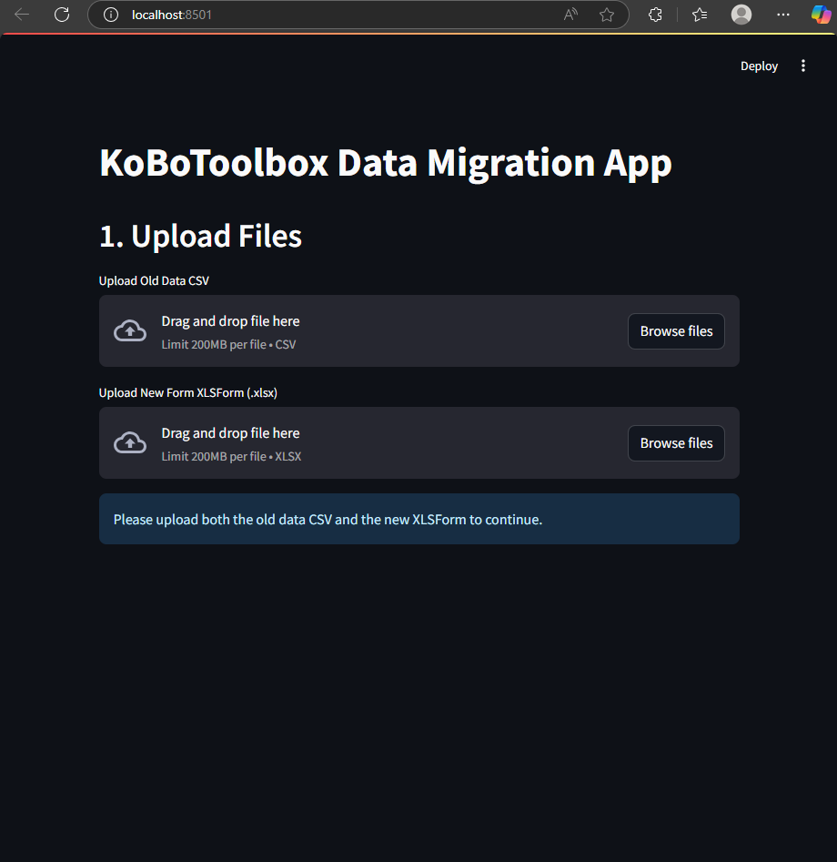

# 📊 KoBoToolbox Data Mapping App

A simple and powerful Streamlit app to migrate and transform old KoBoToolbox data into new form formats using XLSForm. This tool allows you to interactively map fields, add new ones, validate required fields, and batch-submit data via the KoBoToolbox API.

---

## 🧰 Features

- Upload old data CSV and new XLSForm `.xlsx`
- Interactive field mapping using Streamlit
- Add custom fields with default values
- Validate required fields from XLSForm
- Preview mapped data before submission
- Batch API submission to KoBoToolbox
- Downloadable YAML mapping file and status logs

---

## 🚀 Getting Started

### Prerequisites

Ensure Python is installed, then install dependencies:

```bash
pip install -r requirements.txt
```

### Clone the repo:
```bash
git clone https://github.com/your-username/data-mapping-app.git
cd data-mapping-app
```
#### Create a virtual environment (optional but recommended)


### Running the App

```bash
streamlit run main.py
```

The app will open in your browser automatically.

---

## 🗂 Project Structure

```
data-mapping-app/
├── main.py                 # Streamlit app code
├── README.md               # This file
├── requirements.txt        # Python dependencies
├── LICENSE                 # MIT License (or your choice)
├── .gitignore              # Ignored files for Git
└── sample_data/            # Sample files for testing
    ├── old_data_sample.csv
    └── new_form_sample.xlsx
```

---

## 🧪 Sample Files

Use the `sample_data/` folder to test how the app works before using real data.

---

## 🧠 Tech Stack

- **Streamlit** – Frontend UI
- **Pandas** – Data manipulation
- **NumPy** – Handling missing values
- **YAML** – Saving field mappings
- **Requests** – KoBoToolbox API integration

---

## 🧪 Usage

Make sure to provide:
- A CSV dataset (old_data_sample.csv)
- A valid XLSForm (form_template.xlsx)
- Your KoBoToolbox API Token and Form ID

---
## Screenshots

Here is a preview of the **KoBoToolbox Data Migration App** in action:




---

## 📄 License

This project is licensed under the MIT License - see the LICENSE file for details.
